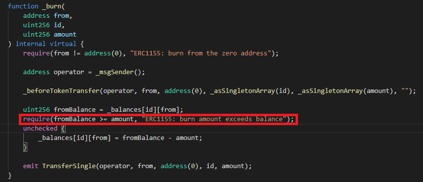
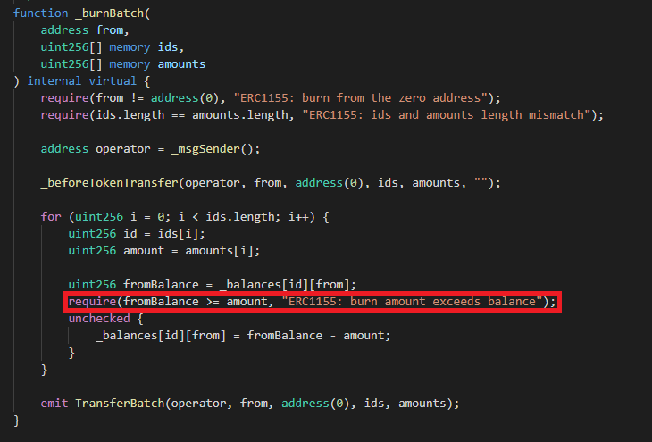

# Cool Cats Solidity Test

This repo contains a number of mistakes and places where improvements can be made. Please made any adjustments you see fit.
We have deliberately made some very silly mistakes and simple things like file names might be wrong or inconsistent.

### ERC1155SupplyCC

Why was this file used and not used directly from the OpenZeppling library?
  > ### Anwser  
  >This is used for tracking the total supply amount for each nft id. The total supply amount is inceased by the amount when minting and decreased when burning. The difference from openzeppelin's extension is to check if the burning amount exceeds the total supply amount. By the way, this checking block is not needed, I think. This checking block is called only when burning, and as you can see at below images, ERC1155's burn function checks if the amount to burn exceeds the frombalance. And of course, the frombalance is equal or small than the total supply since the minting and transferring logic.
  That's why your checking logic is deprecated, needless, and gas costable operation. So I am using the openzeppelin's extension.
  
    

### Claim()

Please adjust the claim function so that an address can only claim once per day.

## Unit Tests

At Cool Cats we write unit tests for 100% coverage and for as many edge cases as we can think of. Please do the same here.

## Deployment Script/Task

Please create a deployment script or task. Which ever you feel is most appropriate
